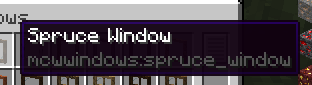

# Realistic Storage

## What does it do?

### No block in containers
All large blocks (such as dirt, cobble, stairs, etc) are not permitted anymore in chests, etc. You have to find alternative storage solutions for these (see the Pallet below). Only items and small blocks (torches, flowers, etc) are permitted in chests. Minecart chests are not checked, to encourage their use for transporting resources. Everything is configurable, mod support requires manual config (see below).


### Pallet block
New block: the Pallet (comes in all Wood variants). All blocks placed on the pallet (up to 8 blocks above it) come back to your inventory instantly when left-clicked. Right-click on a pallet will automatically stack blocks above the pallet (up to the limit of 8). Adjacent pallets will share the blocks added with right-click, so that a group of pallets acts like a large container. Time to build some warehouses!

Note: block placed _before_ the pallet will still have to be mined normally. This prevents insta-mining and free feather touch. This also allow you to put a roof above the pallet without risk of destroying it by mistake.


### Limited inventory slots
For a more extreme experience, inventory slots can be disabled as well (configurable): limit to 9 to keep only the hotbar, or even 2 for the most realistic experience! The [Tool Belt mod](https://www.curseforge.com/minecraft/mc-mods/tool-belt) is the ideal companion for this feature.


## How does it work?

Anything in the chest is ejected if it can be placed in the world. Exceptions to this simple rule (black list and white list) are defined in the config file. Regular expressions (regex) are allowed, in order to make config a bit faster. The default config covers only vanilla items and containers.

*The restriction can be bypassed using hoppers. Consider this mod as an encouragement for role-play.*


## Configure containers
First, make sure that you have set
```
print_container_names = true
```
in the config file (`config/realisticstorage_common.toml`). Don't forget to restart the game after changing the config file. Then, open and close a container in-game to show its name in the chat.


And add this name to the list of checked containers in the config:

```
checked_container = ["StorageTileEntity", ...
```


## Configure items
1. Press F3+H in game to show advanced tooltips.

2. Hover over the item to configure, and note the registry name in the tooltip.

3. In the config file, add the registry name either to `never_ejected` to make sure it is allowed in containers, or `always_ejected` to make sure it is not allowed.
```
never_ejected = ["decorative_blocks:bar_panel", ...
```
If there are multiple variations of the item, you can use regular expression to match all of them at once. For example, to add all windows from Macaw's Windows



Add a regex such as
```
never_ejected = ["mcwwindows:.*_window", ...
```
To match all items from the mod that end with `_window`. Or even
```
never_ejected = [".*_window", ...
```
To match all items from all mods that end with `_window`. See the default config for more examples.

## Credits
This mod is inspired from [Oversized Item in Storage Area](https://www.curseforge.com/minecraft/mc-mods/oversized-item-in-storage-area) by DoubleDoorDev for the container part, and by [Trophy Slots](https://www.curseforge.com/minecraft/mc-mods/trophy-slots) from Lomeli12 for the limited slots part.